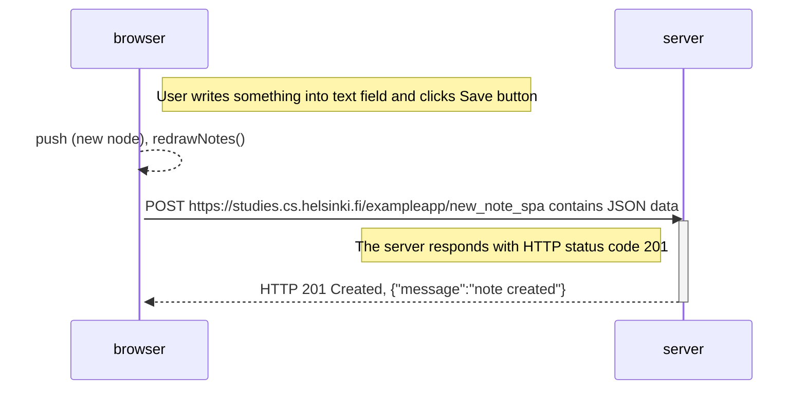

```mermaid
sequenceDiagram
    participant browser
    participant server
    Note right of browser: User writes something into text field and clicks Save button

    browser-->>browser: push (new node), redrawNotes()
    activate browser

    browser->>server: POST https://studies.cs.helsinki.fi/exampleapp/new_note_spa contains JSON data
    activate server

    Note left of server: The server responds with HTTP status code 201

    server-->>browser: HTTP 201 Created, {"message":"note created"}
    deactivate server
```
